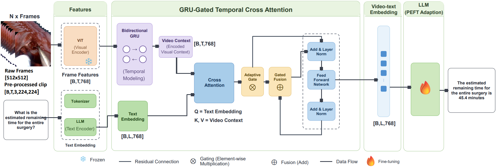

# Anticipating Surgical Events via GRU-Gated Temporal Cross-Attention in Video Question Answering



<div align='center'>

</div>

## Abstract

**Purpose:** Anticipating forthcoming surgical events is vital for real-time assistance in endonasal transsphenoidal pituitary surgery, where visibility is limited and workflow changes rapidly. Most visual question answering (VQA) systems reason on isolated frames with static vision--language alignment, providing limited support for forecasting forthcoming steps, instrument needs, or remaining procedure time. Existing surgical VQA datasets likewise focus primarily on the current scene rather than the near future.

**Methods:** We introduce PitVQA-Anticipation, a VQA dataset designed for forward-looking surgical reasoning. It comprises 33.5 hours of operative video and 734,769 question--answer pairs built from temporally grouped clips and expert annotations across four tasks: predicting the future phase, next step, upcoming instrument, and remaining duration. We further propose SurgAnt-ViVQA, a video-language model that adapts a large language model using a GRU-Gated Temporal Cross-Attention module. A bidirectional GRU encodes frame-to-frame dynamics, while an adaptive gate injects visual context into the language stream at the token level. Parameter-efficient fine-tuning customizes the language backbone to the surgical domain.

**Results:** On PitVQA-Anticipation, SurgAnt-ViVQA achieved BLEU-4 72.38, ROUGE-L 84.94, and METEOR 87.05, outperforming the evaluated image-based and video-based baselines. It also generalized to the EndoVis18-VQA benchmark. The ablation results support the effectiveness of the combined GRU-gated temporal fusion module for anticipatory VQA, while further controlled experiments are required to fully disentangle the independent contributions of recurrence and adaptive gating. A frame-budget study indicates a trade-off: 8 frames maximize linguistic overlap metrics, whereas 32 frames slightly reduce BLEU but improve numeric time estimation.}

**Conclcusion**: By pairing a temporally aware encoder with fine-grained gated cross-attention, SurgAnt-ViVQA advances surgical VQA from retrospective description toward proactive anticipation. PitVQA-Anticipation provides a computational benchmark for future-aware surgical reasoning; prospective clinical utility requires further validation with surgeons and operating-room staff.

## PitVQA-Anticipation Dataset

Dataset will be released upon the paper acceptance

## SurgAnt-ViVQA Pretrained Weights

The pretrained weights will be releases upon the acceptance of the paper

## Training Command

```
python main.py --seq_frames 8
```

## Inference Command

```
python inference.py --seq_frames 8
```

## Acknowlwdgement

The implementation of SurgicalViVQA relies on resources from  <a href="https://github.com/huggingface/transformers">Huggingface Transformers</a>, <a href="https://github.com/huggingface/peft">PEFT</a>, <a href="https://github.com/xuguohai/X-CLIP">X-CLIP</a>, <a href="https://github.com/HRL-Mike/PitVQA-Plus">PitVQA++</a>. We thank the original authors for their open-sourcing.
